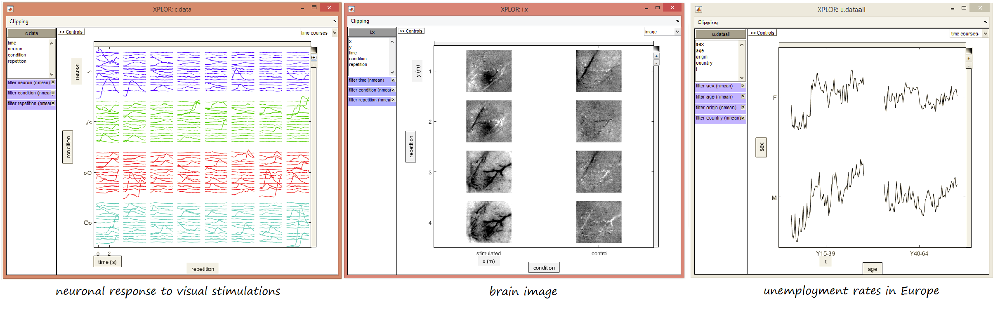

.. xplor-matlab documentation master file, created by
   sphinx-quickstart on Mon Sep 16 13:53:45 2019.
   You can adapt tghis file completely to your liking, but it should at least
   contain the root `toctree` directive.

Welcome to xplor-matlab's documentation!
========================================

Xplor is an opensource toolbox to visualise easily N dimensional data.
   .. raw:: html

      <iframe width="560" height="315" src="https://www.youtube.com/embed/FU2xWCdarK8" frameborder="0" allow="accelerometer; autoplay; encrypted-media; gyroscope; picture-in-picture" allowfullscreen></iframe>

.. image:: usage/image/presentation-filter02.png

It started as a project for neuroscience at CNRS (French National Center for Scientific Research), however it can be used for any type of data as shown in the examples below.

Table of contents:

.. toctree::
   :maxdepth: 3

   usage/user

.. module:: xplr
.. automodule:: +xplr
