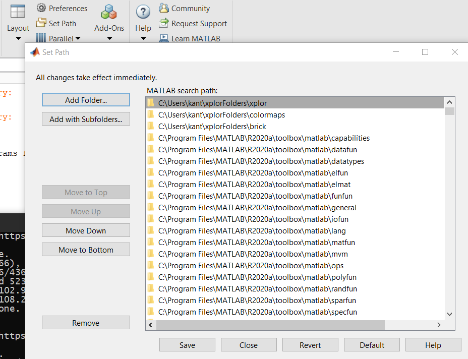
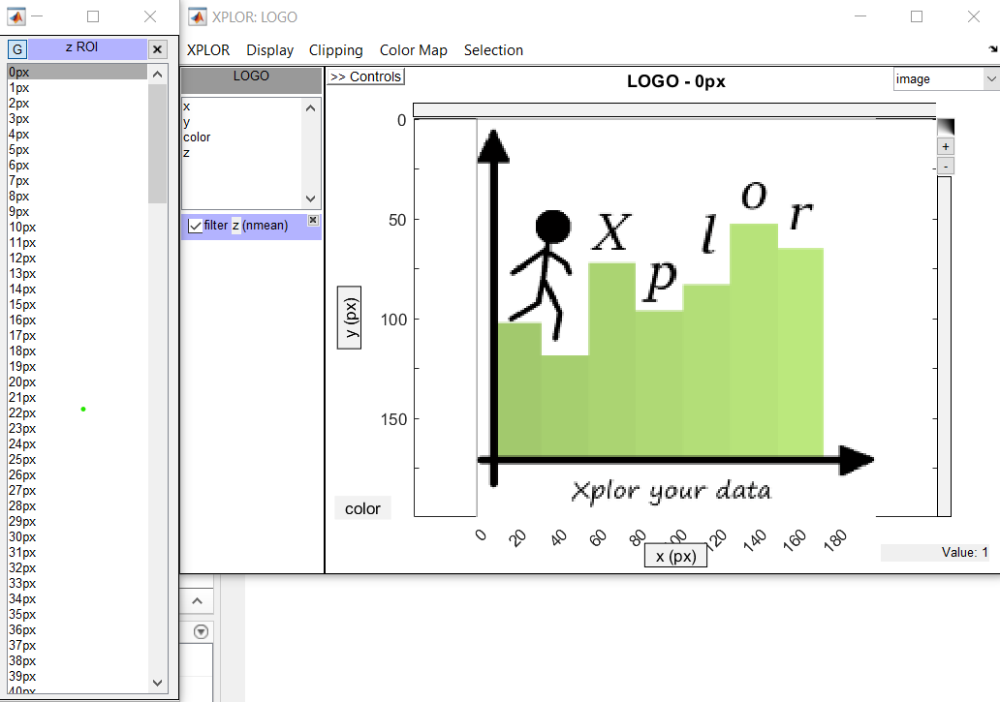

Install
*********************
xplor needs a few components available on Github:

Download the sources
------------------------

Download or clone `xplor`_
	
	.. _xplor: https://github.com/XplorMatlab/xplor

Don't know what is 'clone'?
If you 'clone' with git instead of 'download' it will be very
straightforward to obtain new versions of XPLOR in the future. All what you
need to know is the following:

- on Windows you need to install git from https://git-scm.com/download/win
  (git is already included on linux and OSX)
- to download a folder, type e.g. `git clone https://github.com/XplorMatlab/xplor`
- to update a folder with the latest version, go inside the folder and type
  `git pull`.

Configure Matlab
-----------------

Add the root `xplor` folder to your paths (but not sub-folders):

Try
----

Try to start xplor by typing:

.. code-block:: javascript

    xplor

in the commandline. It will load a default dataset.

To load your own dataset :

.. code-block:: javascript

    xplor my_data

Where my_data is the name of your own data variable.
